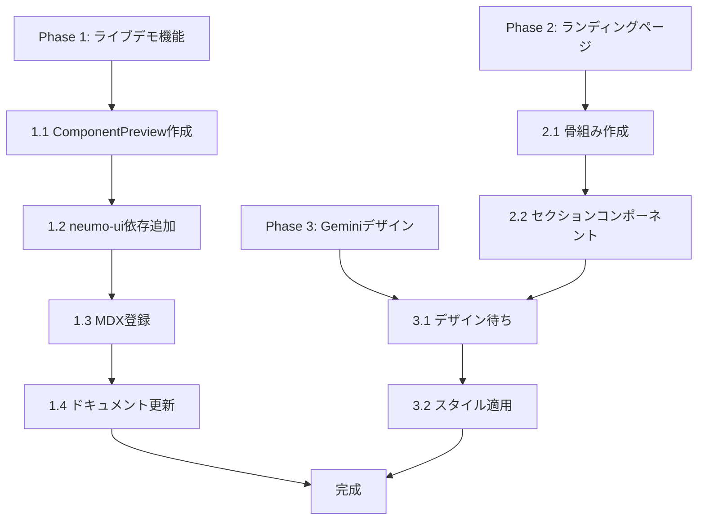

# Neumo UI サイト改善プラン

## 概要

ドキュメントサイトの充実とランディングページ作成を並行で進める。

- 私（Claude）: 技術実装、骨組み作り、ライブデモ機能
- Gemini: デザイン案、ビジュアル、レイアウト提案

---

## Phase 1: ライブデモ機能の実装

### 1.1 ComponentPreviewコンポーネント作成

コードとプレビューを並べて表示するコンポーネントを作成。

**作成ファイル:** `apps/docs/components/ui/component-preview.tsx`

```tsx
// イメージ
<ComponentPreview>
  <Preview>
    <Button variant="primary">Click me</Button>
  </Preview>
  <Code>
    {`<Button variant="primary">Click me</Button>`}
  </Code>
</ComponentPreview>
```

### 1.2 neumo-uiをdocsに追加

[apps/docs/package.json](apps/docs/package.json) に neumo-ui を依存関係として追加し、コンポーネントをインポートできるようにする。

### 1.3 MDXコンポーネント登録

[apps/docs/mdx-components.tsx](apps/docs/mdx-components.tsx) に `ComponentPreview` を追加し、MDXファイルから使えるようにする。

### 1.4 ドキュメント更新

`content/docs/components/*.mdx` にライブデモを追加。例: [apps/docs/content/docs/components/button.mdx](apps/docs/content/docs/components/button.mdx)

---

## Phase 2: ランディングページの骨組み作成

### 2.1 セクション構成

[apps/docs/app/(home)/page.tsx](apps/docs/app/\\(home)/page.tsx) を以下のセクション構成で作成:

```
1. HeroSection - キャッチコピー + CTA
2. FeaturesSection - 4つの特徴
3. ShowcaseSection - コンポーネントのデモ
4. CodeExampleSection - 使用例コード
5. InstallSection - インストール方法
6. Footer - リンク集
```

### 2.2 各セクションコンポーネント

**作成ディレクトリ:** `apps/docs/components/landing/`

- `hero-section.tsx`
- `features-section.tsx`
- `showcase-section.tsx`
- `code-example-section.tsx`
- `install-section.tsx`

### 2.3 仮スタイリング

Geminiのデザイン待ちの間、最小限のスタイルで骨組みだけ作成。後からデザイン適用しやすい構造にする。

---

## Phase 3: Geminiとの連携

### 3.1 デザイン要件書

既に作成済み: [docs/design-requirements.md](docs/design-requirements.md)

### 3.2 Geminiへの依頼内容

1. ランディングページのワイヤーフレーム/デザイン案
2. カラー・タイポグラフィの提案
3. コンポーネントショーケースのアイデア

### 3.3 デザイン反映

Geminiからデザイン案を受け取ったら、骨組みにスタイルを適用。

---

## ファイル構成（新規作成）

```
apps/docs/
├── components/
│   ├── ui/
│   │   └── component-preview.tsx    # ライブデモ用
│   └── landing/
│       ├── hero-section.tsx
│       ├── features-section.tsx
│       ├── showcase-section.tsx
│       ├── code-example-section.tsx
│       └── install-section.tsx
```

---

## 実装順序



---

## 注意点

- Fumadocs v16 + Next.js 16 + React 19 環境
- Tailwind CSS v4 を使用
- neumo-ui のスタイル（`neumo-ui/styles.css`）をdocsでも読み込む必要あり