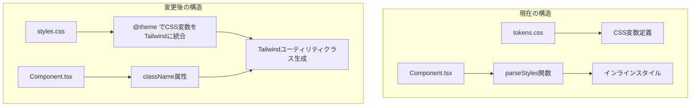

# Tailwind CSS v4 導入計画

## 現状の問題点

- 全コンポーネントが`parseStyles`関数でCSS文字列をインラインスタイルに変換している
- Microsoft Edge Toolsから「CSS inline styles should not be used」の警告が発生
- requirements.mdでは「Tailwind CSS v4」を使用する予定だが、実際には導入されていない

## アーキテクチャ



## 変更対象ファイル

### 新規作成

- [postcss.config.cjs](packages/neumo-ui/postcss.config.cjs) - PostCSS設定
- [packages/neumo-ui/src/styles/index.css](packages/neumo-ui/src/styles/index.css) - Tailwindエントリーポイント

### 修正

- [packages/neumo-ui/package.json](packages/neumo-ui/package.json) - 依存関係追加
- [packages/neumo-ui/tsup.config.ts](packages/neumo-ui/tsup.config.ts) - CSS処理対応
- [packages/neumo-ui/src/styles/tokens.css](packages/neumo-ui/src/styles/tokens.css) - `@theme`統合
- 6つのコンポーネント（Button, Card, Input, Avatar, Badge, Divider）

### 削除

- [packages/neumo-ui/src/components/Button/Button.css](packages/neumo-ui/src/components/Button/Button.css) - 先ほど作成したCSS（統合後不要）

## 実装方針

### 1. Tailwind v4のCSS変数統合

既存の`tokens.css`のCSS変数を`@theme`ディレクティブで統合し、Tailwindユーティリティとして使えるようにする。

```css
@import "tailwindcss";

@theme {
  /* 色 */
  --color-neumo-bg: #e0e5ec;
  --color-neumo-primary: #6366f1;
  /* シャドウ */
  --shadow-neumo-1: 4px 4px 8px var(--neumo-shadow-dark), -4px -4px 8px var(--neumo-shadow-light);
  /* スペーシング */
  --spacing-neumo-sm: 8px;
  /* 角丸 */
  --radius-neumo-md: 12px;
}
```

### 2. コンポーネントのクラス構成

各コンポーネントで`className`プロパティを受け取り、Tailwindクラスと結合する。

clsxやtailwind-mergeは使わず、シンプルな文字列結合で実装。

```tsx
// 例: Button
<button
  className={`inline-flex items-center justify-center bg-neumo-bg shadow-neumo-1 
    rounded-neumo-md px-neumo-md py-neumo-sm ${className}`}
>
```

### 3. 動的スタイル（hover/active/focus）の対応

Tailwindのstate variants（`hover:`, `active:`, `focus:`）を使用。

```tsx
className="shadow-neumo-1 hover:shadow-neumo-hover active:shadow-neumo-active"
```

## 依存関係

```json
{
  "devDependencies": {
    "tailwindcss": "^4.0.0",
    "@tailwindcss/postcss": "^4.0.0",
    "postcss": "^8.5.0",
    "autoprefixer": "^10.4.0"
  }
}
```